<!-- cSpell:ignore ESRB Gameplay minijuegos minimalista desbloqueables -->

# 📜 **Documento de Diseño de Juego (GDD)**

## <!-- https://en.namu.wiki/w/Geometry%20Dash/%EC%98%A4%EB%B8%8C%EC%A0%9D%ED%8A%B8%20%EC%9D%BC%EB%9E%8C -->

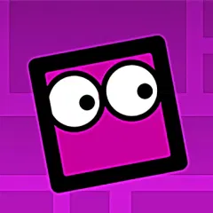
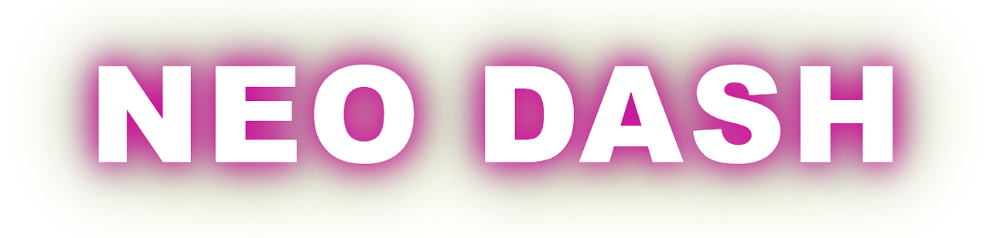

## 📌 **1. Portada**

**🎮 Nombre del Juego:** _Neo Dash_  
**🎭 Género del Juego:** _Plataformas, Ritmo_  
**👤 Autor:** _Adrian Camilo Tuta_  
**📧 Contacto:** _camilotuta2004@gmail.com_  
**🖥️ Plataformas Objetivo:** _PC Web_  
**👥 Audiencia Objetivo:** _Jóvenes entre 10 y 25 años_  
**📅 Posible Fecha de Lanzamiento:** _13/04/2025_  
**🔞 ESRB Estimado:** _E (Everyone)_

---

## 📖 **2. Historia y Gameplay**

### 🎭 Historia

_Neo Dash no tiene una historia definida, el objetivo es superar niveles saltando y esquivando obstáculos sincronizados con la música._

### 🎮 Gameplay

_El jugador controla un cubo que avanza automáticamente a través de niveles llenos de obstáculos, sincronizados con la música. Solo puede saltar al tocar la pantalla o presionar un botón. Hay diferentes modos de juego, como el modo cubo y de nave, que cambian las mecánicas de movimiento._

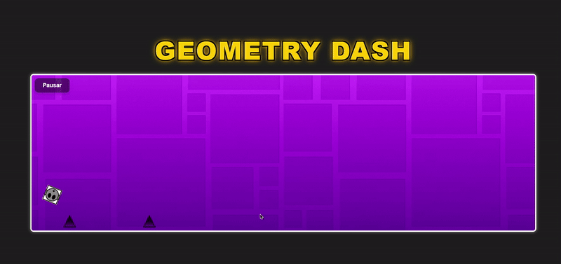

---

## 🔄 **3. Flujo del Juego (Game Flow)**

- 📈 **Progresión del Personaje:** _No hay progresión de personaje, solo habilidades del jugador._
- 🎯 **Dificultad Progresiva:** _Los niveles son cada vez más desafiantes y requieren reflejos más precisos._


- 🔄 **Sistemas de Juego:** _Sistema de niveles, logros y recompensas._

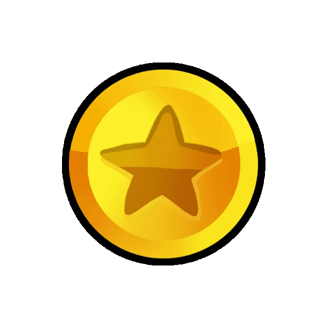 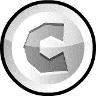

- 🏆 **Recompensas:** _Íconos y colores personalizados._


---

## 🕹️ **4. Personajes y Controles**

### 👤 Personaje Principal

🖌️ **Diseño:** _Un cubo personalizable con diferentes apariencias._  
🎮 **Controles:** _Los botones establecidos para saltar con espacio, flecha hacia arriba y click izquierdo del mouse para saltar (o mantener presionado para volar con la nave)._  
⚡ **Movimientos Únicos:** _Saltar, cambiar de gravedad, volar en nave, rebotar en trampolines._  
🕹️ **Esquema de Controles:**

```markdown
[Un solo botón para interactuar con el juego]
```

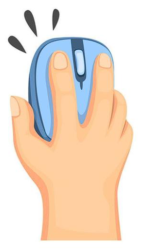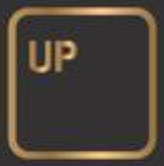 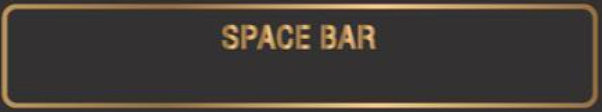

---

## 🎭 **5. Conceptos del Gameplay y Características de Plataforma**

- 📜 **Género:** _Plataformas, Ritmo._
- 🎯 **Estructura del Juego:** _Niveles predefinidos._
- 🎲 **Minijuegos:** _No tiene minijuegos._
- 🛠️ **Características Específicas:** _Sincronización con la música, editor de niveles._

---

## 🌍 **6. Mundo del Juego**

🌎 **Descripción de los Mundos:** _No hay mundos definidos, cada nivel tiene su propio diseño visual._  
🎨 **Arte Conceptual:**

```markdown
[Colores vibrantes y efectos de neón]
```

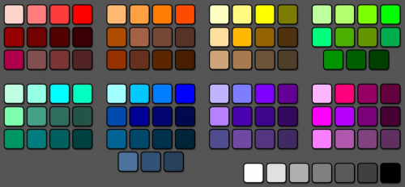
📍 **Diagrama de Navegación:**

```markdown
[Avance lineal en cada nivel sin rutas alternas]
```

---

## 🖥️ **7. Interfaz**

📌 **Navegación del Jugador:** _Menú principal con acceso a niveles, tienda, opciones y editor._  
🎭 **Sensaciones y Estilo:** _Minimalista y colorido con animaciones dinámicas._  
📊 **Flujo de Interfaz:**

```markdown
[Menú principal → Selección de nivel → Juego → Resultados]
```

---

## ⚙️ **8. Mecánicas y Power-Ups**

🔄 **Mecánicas:** _Saltar, cambiar de gravedad, volar en nave._  
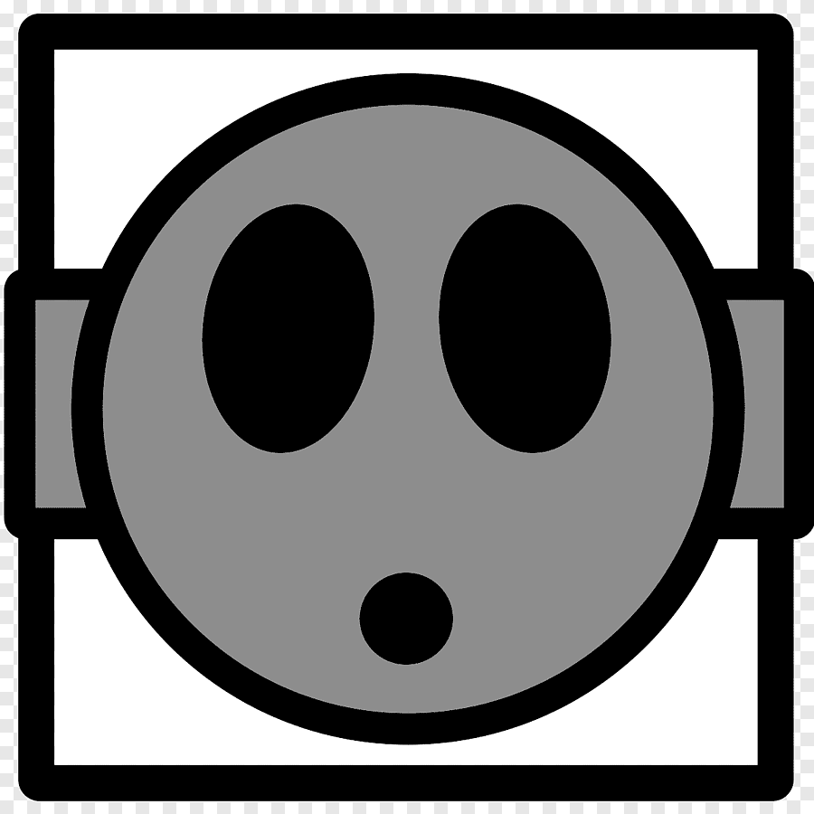
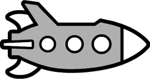
⚡ **Power-Ups:** _Portales de cambio de gravedad, aceleradores, plataformas de salto._

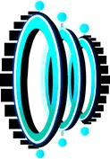 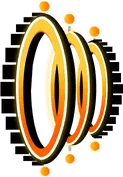

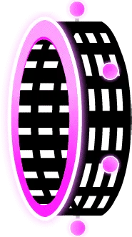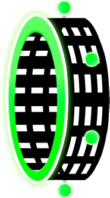

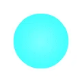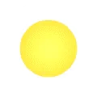


---

## 👾 **9. Enemigos y Jefes**

### 👿 Enemigos

_No hay enemigos directos, los obstáculos son los principales desafíos._  

 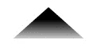 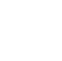 
 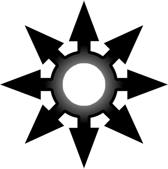

### 👹 Jefes

_No hay jefes, pero algunos niveles presentan secciones extremadamente difíciles._

---

## 🎬 **10.: Cinemáticas, Material Bonus y Competencia**

🎥 **Cinemáticas:** _No tiene cinemáticas._  
🎨 **Material Bonus:** _Iconos desbloqueables, colores personalizados, efectos._  
🎮 **Competencia:** _Super Meat Boy, The Impossible Game, Bit.Trip Runner._
